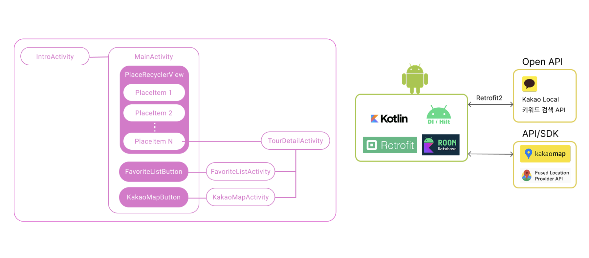
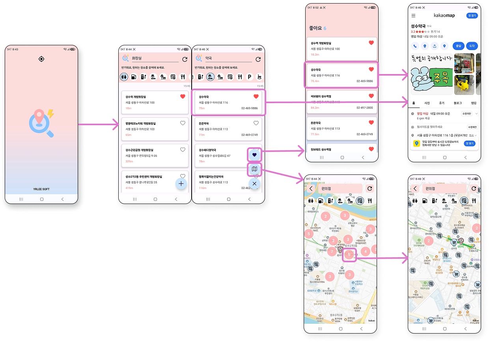

# 서치플레이스 SearchPlace
- Android Native App, 1인 제작

## 개요
### 내 주변 공공장소를 빠르게 검색하고 길찾기까지 지원하는 공공장소 서치 앱입니다.
- 급하게 공공장소를 방문해야 할 때 현재 위치를 기반으로 주변 공공장소를 검색하여 빠르게 확인할 수 있다.
- 검색 결과는 현재 위치를 기반으로 가까운 순으로 정렬되며, 카카오맵과 연동하여 목적지까지 길찾기를 이용할 수 있다.
- 좋아요 기능을 통해 관심있는 장소들을 한 눈에 볼 수 있다.
- 지도 화면을 통해 찾으려는 장소의 위치를 직관적으로 확인할 수 있다.

## 기술 스택
- Language : Kotlin
- Architecture : MVVM
- UI : XML, Data Binding
- Network : Retrofit2, OkHttp3
- Local Database : Room(SQLite)
- Dependency Injection : Hilt
- Development Environment : Android Studio
- API / SDK : Kakao Maps SDK, Google Fused Location Provider
- Open API : Kakao Local API

## 사용기술
- Kakao Local API를 활용한 주변 장소 검색
- 현재 위치 기반 검색(GPS)
- Room을 이용한 즐겨찾기 저장
- Hilt를 이용한 의존성 주입
- Retrofit을 이용한 REST API 통신
- MVVM + Data Binding 구조 적용
- RecyclerView 무한 스크롤(페이지네이션)
- Kotlin Coroutines / Flow를 이용한 비동기 처리
- 지도 마커 클러스터링

## 와이어프레임 / 시스템 구조도

## UI Flow

## 주요기능

### 1) 내 위치 주변 장소 조회
#### - 카카오 로컬 검색 API 호출
#### - RoomDB에서 각 장소 아이템의 좋아요 여부 조회
#### - RecyclerView 를 통해 장소 아이템 배치 & 무한 스크롤 페이징 적용
#### - 장소 아이템 클릭 시, 장소 상세 화면으로 이동

  
  
  

### 2) 좋아요 목록 화면
#### - RoomDB에서 좋아요 목록 조회
#### - Recyclerview를 통해 좋아요 아이템 배치
#### - 좋아요 아이템 클릭 시, 장소 상세 화면으로 이동

  
  

### 3) 카카오 지도 화면
#### - 내 위치 주변 장소 조회
#### - Kakao Map SDK 의 Label 기능 활용하여 마커 생성 
#### - 카테고리 별 커스텀 마커 아이콘과 bitmap 기반 클러스터 마커 생성
#### - 장소 마커 클릭 시, Bottom Sheet를 통해 장소 정보 표시
#### - Bottom Sheet 클릭 시, 장소 상세 화면으로 이동

  
  
  

